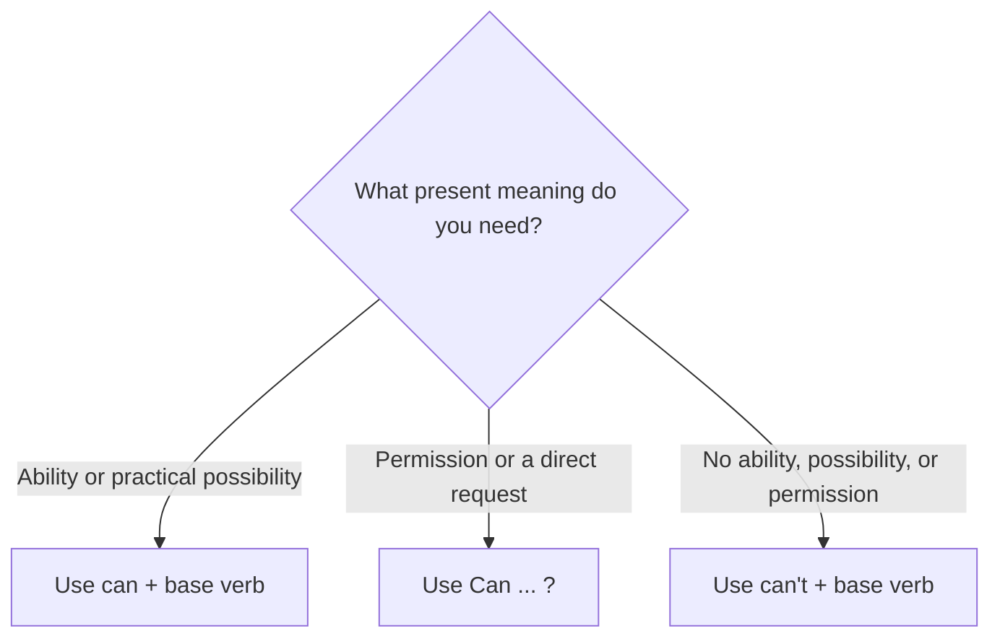

# Can: Present Ability, Permission, and Requests

## Overview

Use **can** to talk about ability or possibility in the present, and to give or ask for permission in everyday English. It is also a common, direct way to make a request.

The same modal expresses several related present-time meanings, so context matters. **Can’t** can mean inability, impossibility, or prohibition; it does not always mean the same thing as **don’t have to**.

## Form patterns

| Use                                     | Form pattern                                                |
| --------------------------------------- | ----------------------------------------------------------- |
| Present affirmative ability             | `subject + can + base verb + rest of the sentence`          |
| Present negative ability or possibility | `subject + cannot/can't + base verb + rest of the sentence` |
| Permission or request question          | `Can + subject + base verb + rest of the sentence?`         |
| Negative permission                     | `subject + cannot/can't + base verb + rest of the sentence` |
| Short answer                            | `subject + can/can't`                                       |

## Examples in context

- Lina **can speak** Japanese well after living in Osaka for two years.
- I **can’t join** the video call this afternoon; I have another meeting.
- **Can I borrow** your charger for a few minutes?
- You **can park** behind the building after six o’clock, but you **can’t park** there during the day.
- “Can you send me the address?” “Sure, I **can**.”

## Decision guide

## Register and frequency

**Can** is the normal everyday choice for present ability and informal permission. It is also natural for direct requests, especially with friends, family, and colleagues. **Could** is often preferred when a request needs to sound more tentative or polite.

## Common pitfalls

- Use the base verb after **can**: `can drive`, not `can to drive` or `can drives`.
- Do not use **do** to form a question: `Can she swim?`, not `Does she can swim?`.
- **Can’t** may mean “not allowed” or “unable”; use the context to distinguish them.
- **Can’t** means that something is not possible or permitted. It does not mean that something is unnecessary; use `don't have to` for that meaning.

## Mini practice

1. Omar \_\_\_ play three instruments.
2. \_\_\_ we use this room after lunch?
3. I \_\_\_ attend the meeting tomorrow morning.
4. Choose the meaning of “You can’t enter this area”: inability, impossibility, or prohibition.

Answers

1. `can`
2. `Can`
3. `can't`
4. `prohibition`

