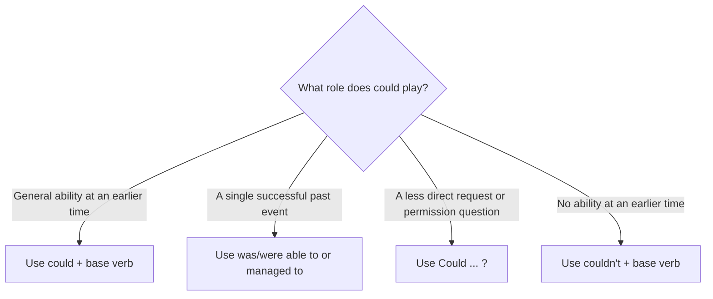

# Could: Past Ability, Polite Requests, and Permission

## Overview

Use **could** for general ability in the past, and use **couldn’t** for a lack of past ability. For one successful event in the past, English usually prefers **was/were able to** or **managed to**.

In present or future interactions, **could** also makes a request or permission question less direct than **can**. Here, **could** is not a past tense: “Could you open the window?” is a polite request about now.

## Form patterns

| Use | Form pattern |
| --- | --- |
| Past general ability | `subject + could + base verb + rest of the sentence` |
| Past negative ability | `subject + couldn't + base verb + rest of the sentence` |
| Polite request question | `Could + subject + base verb + rest of the sentence?` |
| Polite permission question | `Could + subject + base verb + rest of the sentence?` |
| Specific past achievement | `subject + was/were able to + base verb + rest of the sentence` |

## Examples in context

- When Priya was six, she **could read** simple books by herself.
- I **couldn’t hear** the announcement because the station was so noisy.
- **Could you check** these figures before I send the report?
- **Could I leave** a little early today? I have a medical appointment.
- The door was jammed, but we **were able to open** it with a spare key.

## Decision guide

## Register and frequency

**Could** is common and neutral for past general ability. In requests and permission questions, it is more tentative and polite than **can**, but it is not excessively formal. **May I...?** remains a more formal permission option.

## Common pitfalls

- Use the base verb after **could**: `could help`, not `could to help` or `could helps`.
- Do not treat every past success as **could**: `Yesterday, I was able to finish`, not usually `Yesterday, I could finish`.
- In a request, **could** refers to present or future action; it does not necessarily place the request in the past.
- **Couldn’t** means lack of ability or possibility, not lack of obligation. Use `didn't have to` when an action was unnecessary.

## Mini practice

1. When I was younger, I ___ run much faster.
2. ___ you send me the notes when you have time?
3. The team worked late and ___ finish the release before midnight.
4. We ___ enter the lab without a badge, so we waited outside.

Answers

1. `could`
2. `Could`
3. `was able to` or `managed to`
4. `couldn't`

