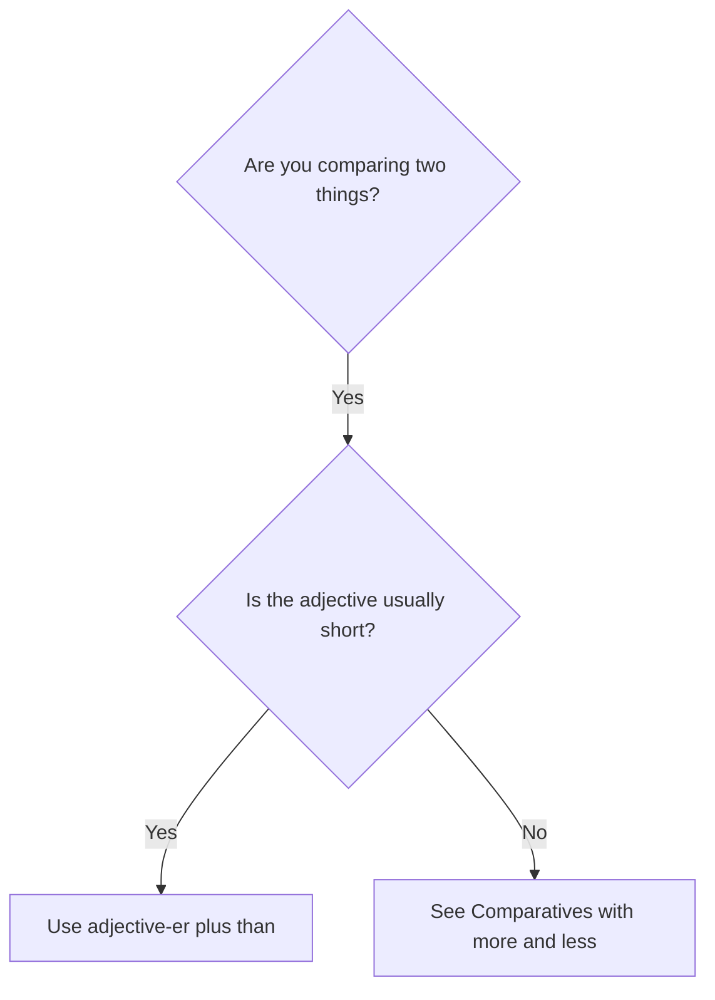

# Comparatives with -er

## Overview

Use **comparatives** to compare two people, things, or situations. Most one-syllable adjectives use `-er`; some two-syllable adjectives also use it.

## Form patterns

| Use | Form pattern |
| --- | --- |
| Comparison | `subject + be + adjective-er + than + comparison` |
| Negative comparison | `subject + be not + adjective-er + than + comparison` |
| Question | `be + subject + adjective-er + than + comparison?` |

## Examples in context

- This room is **smaller than** the other one.
- My new phone is **cheaper than** my old phone.
- Is the blue route **shorter than** the red one?

## Decision guide

## Register and frequency

This is the normal everyday pattern for adjectives such as `fast`, `small`, and `cheap`.

## Common pitfalls

- Use `than`, not `that`, after a comparative.
- Do not say `more cheaper` or `more faster`.
- Add only `-r` after final `-e`: `large → larger`.
- Double the final consonant in many consonant-vowel-consonant words: `big → bigger`.

## Mini practice

1. This bag is ___ than mine. (`light`)
2. Is a train ___ than a bus? (`fast`)
3. The new office is ___ than the old one. (`large`)

Answers

1. `lighter`  
2. `faster`  
3. `larger`

