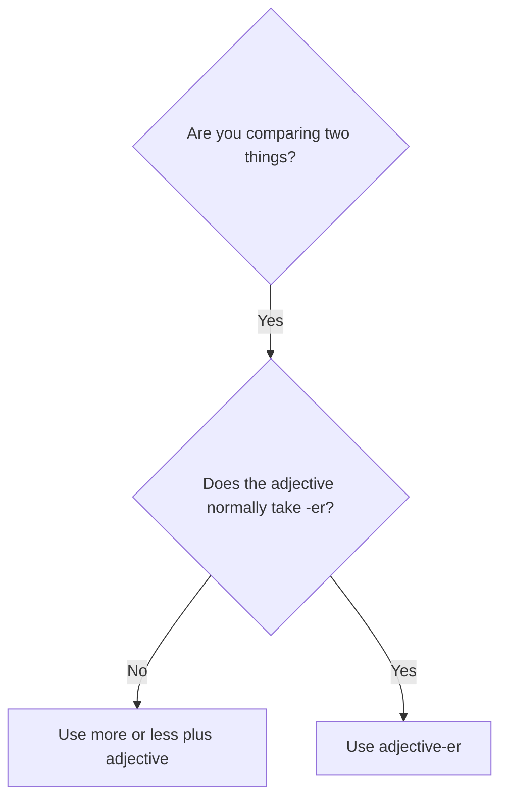

# Comparatives with more and less

## Overview

Use **more** with most longer adjectives. Use **less** when the first thing has a lower degree of the quality.

## Form patterns

| Use | Form pattern |
| --- | --- |
| Higher degree | `subject + be + more + adjective + than + comparison` |
| Lower degree | `subject + be + less + adjective + than + comparison` |
| Question | `be + subject + more/less + adjective + than + comparison?` |

## Examples in context

- This explanation is **more useful than** the previous one.
- The train is **less expensive than** a taxi.
- Is this option **more reliable than** the other one?

## Decision guide

## Register and frequency

`More + adjective` is the everyday default for most adjectives with two or more syllables. Some two-syllable adjectives vary, so learn their common form individually.

## Common pitfalls

- Do not say `comfortabler` or `more easier`.
- Use `than`, not `then`.
- `Less` is a comparison of degree; it is not simply a negative form.

## Mini practice

1. This task is ___ than the last one. (`difficult`)
2. Flying is often ___ than travelling by train. (`convenient`)
3. Is this plan ___ than yours? (`practical`)

Answers

1. `more difficult`  
2. `less convenient`  
3. `more practical`

