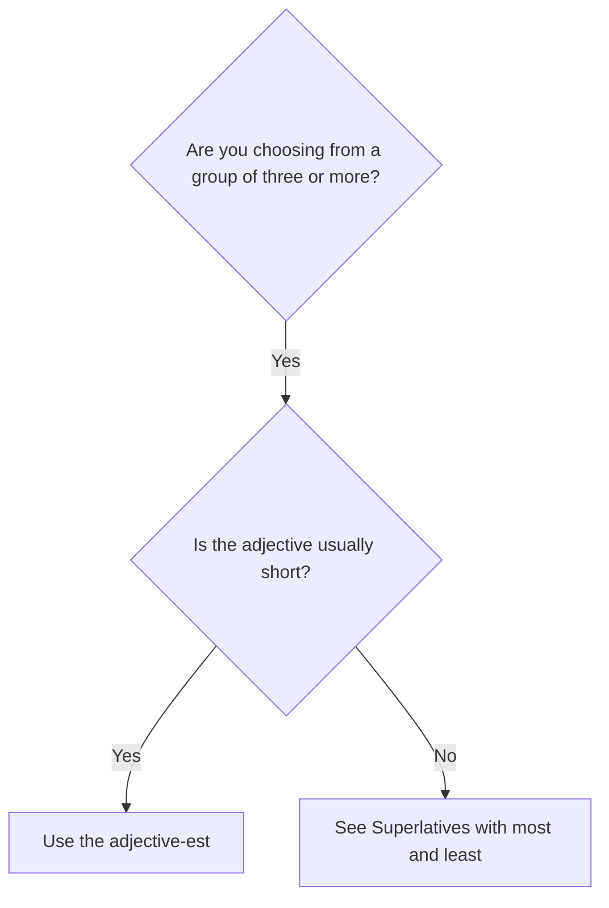

# Superlatives with -est

## Overview

Use a **superlative** to identify the highest or lowest degree within a group. Most short adjectives use `the + adjective-est`.

## Form patterns

| Use | Form pattern |
| --- | --- |
| Superlative statement | `subject + be + the + adjective-est + noun/group` |
| Question | `be + subject + the + adjective-est + noun/group?` |
| Negative | `subject + be not + the + adjective-est + noun/group` |

## Examples in context

- She is **the tallest** person in her family.
- This is **the oldest** building in the city.
- Which is **the cheapest** option?

## Decision guide

## Register and frequency

This is the ordinary pattern for common short adjectives such as `old`, `cheap`, and `tall`.

## Common pitfalls

- Normally include `the`: `the tallest`, not only `tallest`.
- Do not say `the most fastest`.
- Use `-st` after final `-e`: `large → largest`.

## Mini practice

1. Mount Everest is the ___ mountain in the world. (`high`)
2. This is the ___ room in the house. (`small`)
3. Which route is the ___? (`short`)

Answers

1. `highest`  
2. `smallest`  
3. `shortest`

