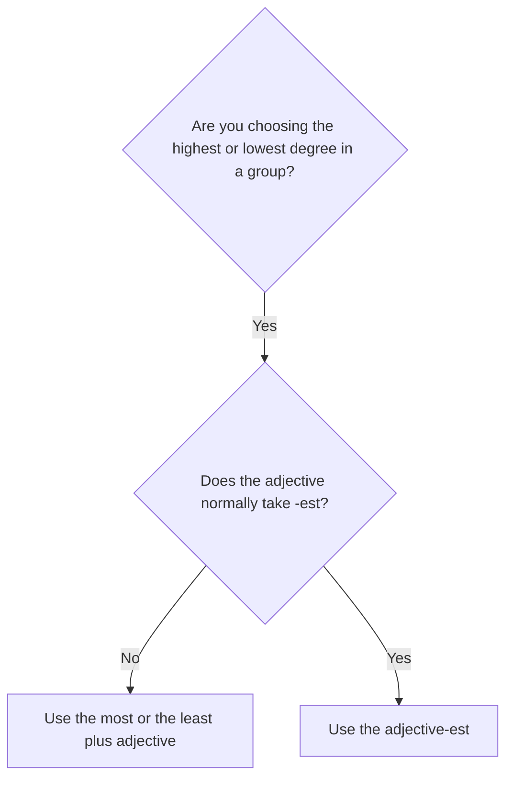

# Superlatives with most and least

## Overview

Use **the most** with most longer adjectives. Use **the least** for the lowest degree within a group.

## Form patterns

| Use | Form pattern |
| --- | --- |
| Highest degree | `subject + be + the most + adjective + noun/group` |
| Lowest degree | `subject + be + the least + adjective + noun/group` |
| Question | `be + subject + the most/least + adjective + noun/group?` |

## Examples in context

- This is **the most interesting** book in the course.
- It was **the least expensive** option.
- Which solution is **the most practical**?

## Decision guide

## Register and frequency

`The most + adjective` is the normal everyday pattern for most longer adjectives.

## Common pitfalls

- Do not say `the interestinger` or `the most easiest`.
- Use `the least`, not `the less`, for a superlative.
- Use a clear group when needed: `the most useful tool in the class`.

## Mini practice

1. This was the ___ decision of my career. (`difficult`)
2. It is the ___ model in the range. (`expensive`)
3. Which explanation is the ___? (`useful`)

Answers

1. `most difficult`  
2. `least expensive`  
3. `most useful`

