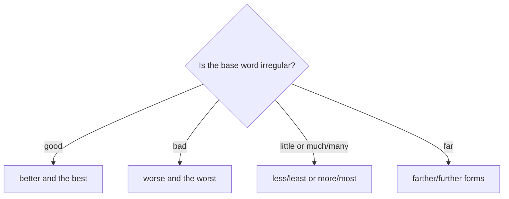

# Irregular comparatives and superlatives

## Overview

Some common words do not use the regular `-er`, `-est`, `more`, or `most` patterns. Learn their forms as complete sets.

## Form patterns

| Base form | Comparative pattern | Superlative pattern |
| --- | --- | --- |
| `good` | `subject + be + better than + comparison` | `subject + be + the best + group` |
| `bad` | `subject + be + worse than + comparison` | `subject + be + the worst + group` |
| `far` | `subject + be + farther/further than + comparison` | `subject + be + the farthest/furthest + group` |
| `little` | `subject + have + less + noun than + comparison` | `subject + have + the least + noun` |
| `much/many` | `subject + have + more + noun than + comparison` | `subject + have + the most + noun` |

## Examples in context

- This option is **better than** the other one.
- That was **the worst** meal of the trip.
- We have **less time than** we expected.

## Decision guide

## Register and frequency

`Further` is common for additional or abstract ideas; `farther` is more often physical distance. In many everyday contexts, both are accepted.

## Common pitfalls

- Do not say `gooder`, `badder`, or `the goodest`.
- Use `fewer` for countable nouns and `less` for uncountable nouns.
- Do not use `more better` in standard English.

## Mini practice

1. This restaurant is ___ than the one near my office. (`good`)
2. We have ___ information than they do. (`little`)
3. It was the ___ experience of the trip. (`bad`)

Answers

1. `better`  
2. `less`  
3. `worst`

