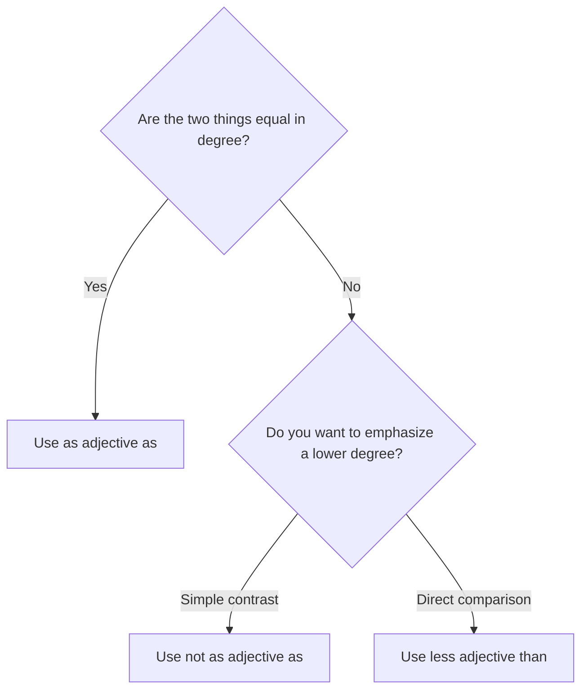

# Equality and inequality

## Overview

Use `as ... as` for equal degree and `not as ... as` for a lower degree. Use `less ... than` to make the lower degree explicit.

## Form patterns

| Use | Form pattern |
| --- | --- |
| Equality | `subject + be + as + adjective + as + comparison` |
| Lower degree | `subject + be not + as + adjective + as + comparison` |
| Explicit lower degree | `subject + be + less + adjective + than + comparison` |

## Examples in context

- This bag is **as light as** that one.
- The blue car is **not as fast as** the red one.
- This route is **less dangerous than** the old road.

## Decision guide

## Register and frequency

`Not as ... as` is very common. `Less ... than` is useful when the lower degree itself is the focus.

## Common pitfalls

- Keep the adjective in its base form: `as fast as`, not `as faster as`.
- Do not say `as more useful as`.
- `Not as ... as` does not mean the two things are equal.

## Mini practice

1. My laptop is as ___ as yours. (`light`)
2. This test is not as ___ as the last one. (`hard`)
3. The new plan is ___ risky than the old plan. (`less`)

Answers

1. `light`  
2. `hard`  
3. `less`

