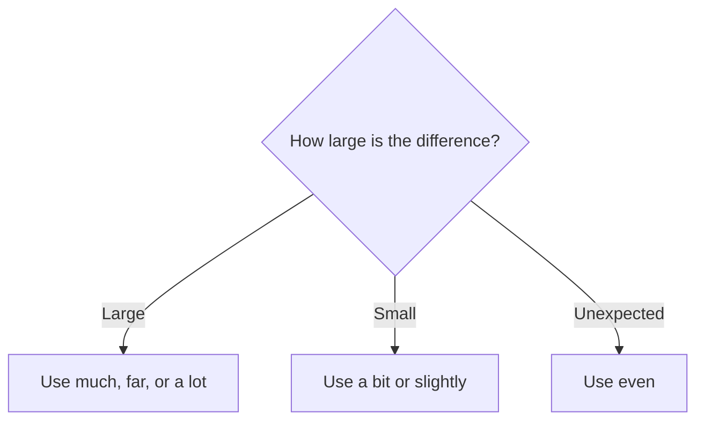

# Comparative intensifiers

## Overview

Use intensifiers before a comparative to show the size of the difference. Choose a strong or small difference according to the context.

## Form patterns

| Meaning | Form pattern |
| --- | --- |
| Large difference | `subject + be + much/far/a lot + comparative + than + comparison` |
| Small difference | `subject + be + a bit/slightly + comparative + than + comparison` |
| Surprise or emphasis | `subject + be + even + comparative + than + comparison` |

## Examples in context

- This route is **much shorter than** the other one.
- The new version is **far more reliable than** the old one.
- Today is **slightly warmer than** yesterday.

## Decision guide

## Register and frequency

`Much` and `far` are neutral. `A lot` is more conversational. `Slightly` is common in formal descriptions and measurements.

## Common pitfalls

- Do not use `very` directly before a comparative: say `much better`, not `very better`.
- Put the intensifier before the comparative.
- Use `more` when the adjective requires it: `far more reliable`.

## Mini practice

1. This repair is ___ cheaper than replacing the machine. (`much`)
2. The second option is ___ more flexible. (`slightly`)
3. Her new apartment is ___ bigger than her old one. (`a bit`)

Answers

1. `much`  
2. `slightly`  
3. `a bit`

