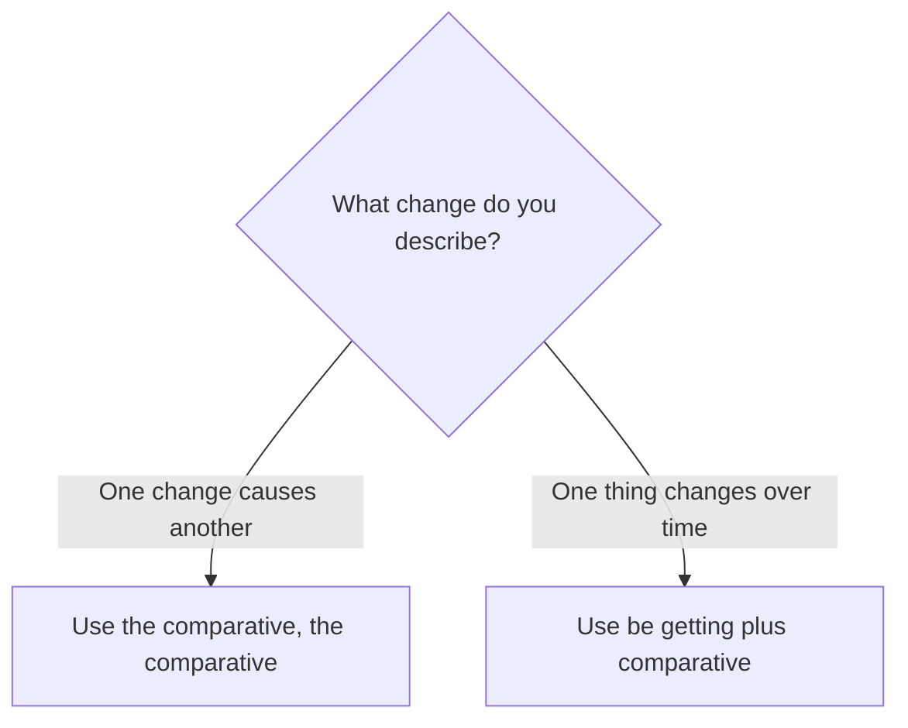

# Progressive comparatives

## Overview

Use progressive comparatives to show change. `The more ..., the more ...` connects two changes; `getting + comparative` describes a continuing change.

## Form patterns

| Use | Form pattern |
| --- | --- |
| Linked change | `the + comparative ..., the + comparative ...` |
| Continuing change | `subject + be + getting + comparative` |
| Continuing change with long adjective | `subject + be + getting + more + adjective` |

## Examples in context

- **The more** you practice, **the more confident** you become.
- The weather is **getting colder**.
- The project is **getting more complicated**.

## Decision guide

## Register and frequency

Both patterns are common in everyday English. `Getting` is especially useful for changes that are visible or continuing now.

## Common pitfalls

- Keep both `the` words: `the more ..., the more ...`.
- Do not say `more you practice, more confident`.
- Use a comparative after `getting`: `getting better`, not `getting gooder`.

## Mini practice

1. The ___ you read, the ___ vocabulary you learn.
2. The days are getting ___. (`short`)
3. The situation is getting ___ difficult. (`more`)

Answers

1. `more / more`  
2. `shorter`  
3. `more`

