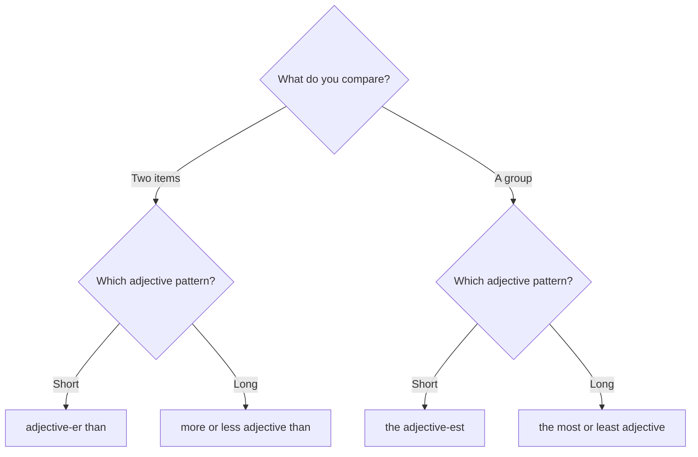

# Review — comparatives and superlatives

## Overview

Use a comparative for two things and a superlative for one item within a group. Then choose the form that matches the adjective and the meaning.

## Quick map

| Meaning | Form pattern |
| --- | --- |
| Two short-adjective items | `subject + be + adjective-er + than + comparison` |
| Two long-adjective items | `subject + be + more/less + adjective + than + comparison` |
| One short-adjective item in a group | `subject + be + the + adjective-est + group` |
| One long-adjective item in a group | `subject + be + the most/least + adjective + group` |

## Examples in context

- This road is **narrower than** the highway.
- It is **the most reliable** option in the list.
- The more you practise, the **better** you become.

## Decision guide

## Register and frequency

Use the common form of each adjective rather than applying syllable rules mechanically. When unsure, check a learner's dictionary.

## Common pitfalls

- Do not combine patterns: avoid `more cheaper` and `the most fastest`.
- Use `than` for a comparison and `the` for most superlatives.
- Use `as ... as` when the degree is equal.

## Mini practice

1. This route is ___ than the other one. (`safe`)
2. She is the ___ student in the class. (`creative`)
3. This phone is not as ___ as mine. (`expensive`)

Answers

1. `safer`  
2. `most creative`  
3. `expensive`

