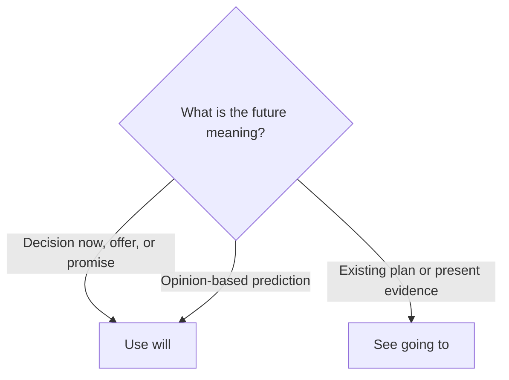

# Will

## Overview

Use **will** for decisions made now, offers, promises, and predictions based mainly on opinion or expectation.

## Form patterns

| Use | Form pattern |
| --- | --- |
| Affirmative | `subject + will + base verb + rest of the sentence` |
| Negative | `subject + will not/won't + base verb + rest of the sentence` |
| Question | `will + subject + base verb + rest of the sentence?` |

## Examples in context

- The phone is ringing. I'll **answer** it.
- I think you **will enjoy** this book.
- Don't worry. I **won't tell** anyone.

## Decision guide

## Register and frequency

`Will` is neutral and extremely common. Contractions such as `I'll` and `won't` are normal in speech and informal writing.

## Common pitfalls

- Use a base verb: `will go`, not `will goes`.
- Do not say `don't will`; use `won't`.
- In ordinary future time clauses, use present simple: `If it rains, we will stay home`.

## Mini practice

1. I am cold. I ___ close the window.
2. I think it ___ be sunny tomorrow.
3. I promise I ___ be late.

Answers

1. `will`  
2. `will`  
3. `won't`

