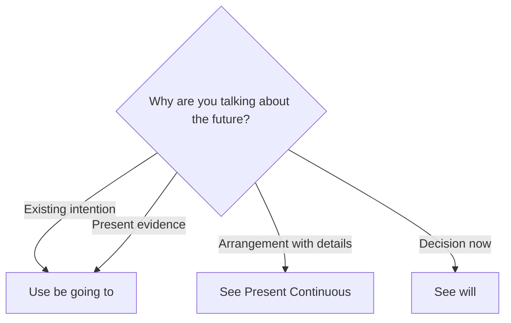

# Be going to

## Overview

Use **be going to** for an existing intention or a prediction supported by present evidence.

## Form patterns

| Use | Form pattern |
| --- | --- |
| Affirmative | `subject + am/is/are going to + base verb + rest of the sentence` |
| Negative | `subject + am/is/are not going to + base verb + rest of the sentence` |
| Question | `am/is/are + subject + going to + base verb + rest of the sentence?` |

## Examples in context

- We'**re going to repaint** the kitchen; we bought the paint already.
- Look at those clouds. It'**s going to rain**.
- **Are** you **going to apply** for the job?

## Decision guide

## Register and frequency

This is a common everyday future form. `Gonna` is common in speech but not in standard formal writing.

## Common pitfalls

- Include `am`, `is`, or `are`.
- Use a base verb after `going to`.
- Do not confuse future `going to study` with movement `going to the library`.

## Mini practice

1. I ___ start a course next month.
2. Look out! You ___ drop that glass.
3. ___ they going to travel in July?

Answers

1. `am going to`  
2. `are going to`  
3. `Are`

