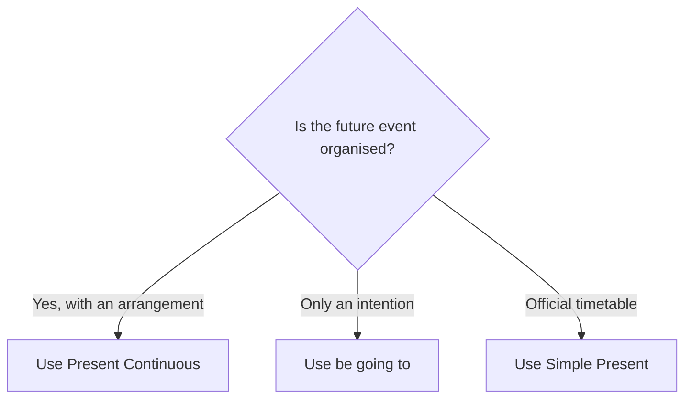

# Present Continuous for future arrangements

## Overview

Use the Present Continuous for a future arrangement that is already organised, often with a time, place, or another person involved.

## Form patterns

| Use | Form pattern |
| --- | --- |
| Affirmative | `subject + am/is/are + verb-ing + future time` |
| Negative | `subject + am/is/are not + verb-ing + future time` |
| Question | `am/is/are + subject + verb-ing + future time?` |

## Examples in context

- I'**m seeing** the dentist at 3 p.m. tomorrow.
- We'**re having** dinner with them on Friday.
- **Are** you **meeting** Sam after work?

## Decision guide

## Register and frequency

This is a very natural everyday form for social and professional arrangements.

## Common pitfalls

- Include `am`, `is`, or `are`.
- Use `verb-ing`, not the base verb.
- Add a future context so the future meaning is clear.

## Mini practice

1. I ___ the dentist tomorrow. (`see`)
2. They ___ married in June. (`get`)
3. ___ you ___ the client on Monday? (`meet`)

Answers

1. `am seeing`  
2. `are getting`  
3. `Are / meeting`

