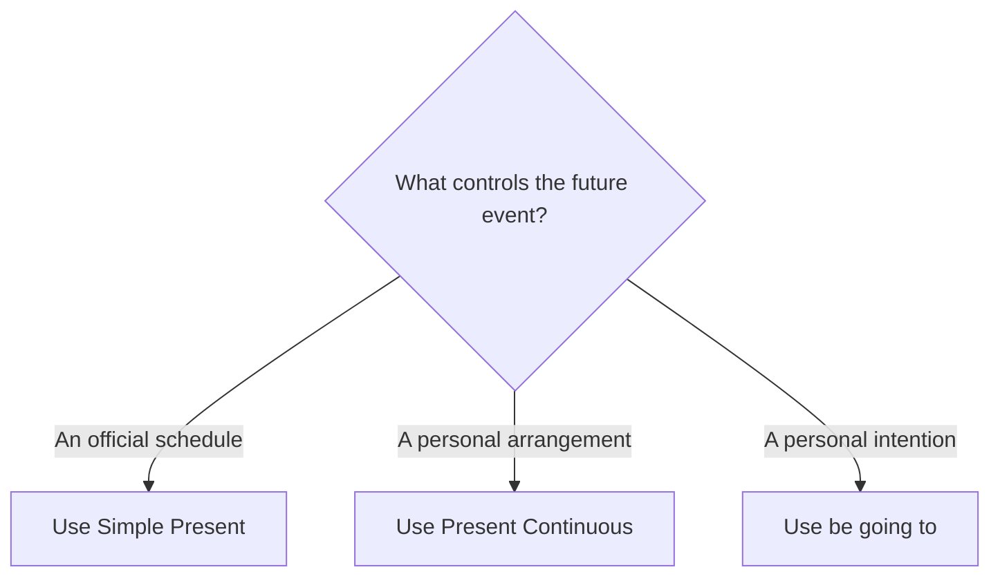

# Simple Present for schedules

## Overview

Use the Simple Present for official timetables, calendars, itineraries, and programmes.

## Form patterns

| Use | Form pattern |
| --- | --- |
| Statement | `subject + simple present verb + future time` |
| Negative | `subject + do/does not + base verb + future time` |
| Question | `do/does + subject + base verb + future time?` |

## Examples in context

- The train **leaves** at 8 p.m.
- The conference **begins** on Thursday.
- What time **does** the flight **arrive**?

## Decision guide

## Register and frequency

This is standard for transport, events, opening times, and published schedules.

## Common pitfalls

- Do not say `will starts`.
- Use `does + base verb` in questions: `does the plane land?`.
- Do not use it for an unarranged personal plan.

## Mini practice

1. The movie ___ at seven. (`start`)
2. What time ___ the bus ___? (`does / leave`)
3. The store ___ on Sunday. (`not open`)

Answers

1. `starts`  
2. `does / leave`  
3. `doesn't open`

