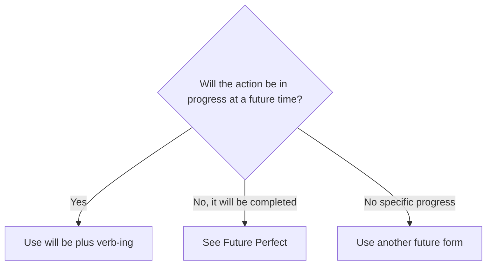

# Future Continuous

## Overview

Use the Future Continuous for an action that will be in progress at a specific future time. It can also make questions about plans sound neutral.

## Form patterns

| Use | Form pattern |
| --- | --- |
| Affirmative | `subject + will be + verb-ing + future time` |
| Negative | `subject + will not be + verb-ing + future time` |
| Question | `will + subject + be + verb-ing + future time?` |

## Examples in context

- This time tomorrow, I **will be flying** to Madrid.
- At 8 p.m., we **will be having** dinner.
- **Will** you **be using** the car tonight?

## Decision guide

## Register and frequency

This form is neutral. Questions with it often sound less direct than `Will you use...?`.

## Common pitfalls

- Use `will be`, not `will` alone.
- Use `verb-ing`, not the base verb.
- Do not use it for a completed action before a deadline.

## Mini practice

1. At noon, I ___ lunch. (`have`)
2. This time next week, they ___ abroad. (`travel`)
3. ___ you ___ the office tomorrow? (`work`)

Answers

1. `will be having`  
2. `will be travelling`  
3. `Will / be working`

