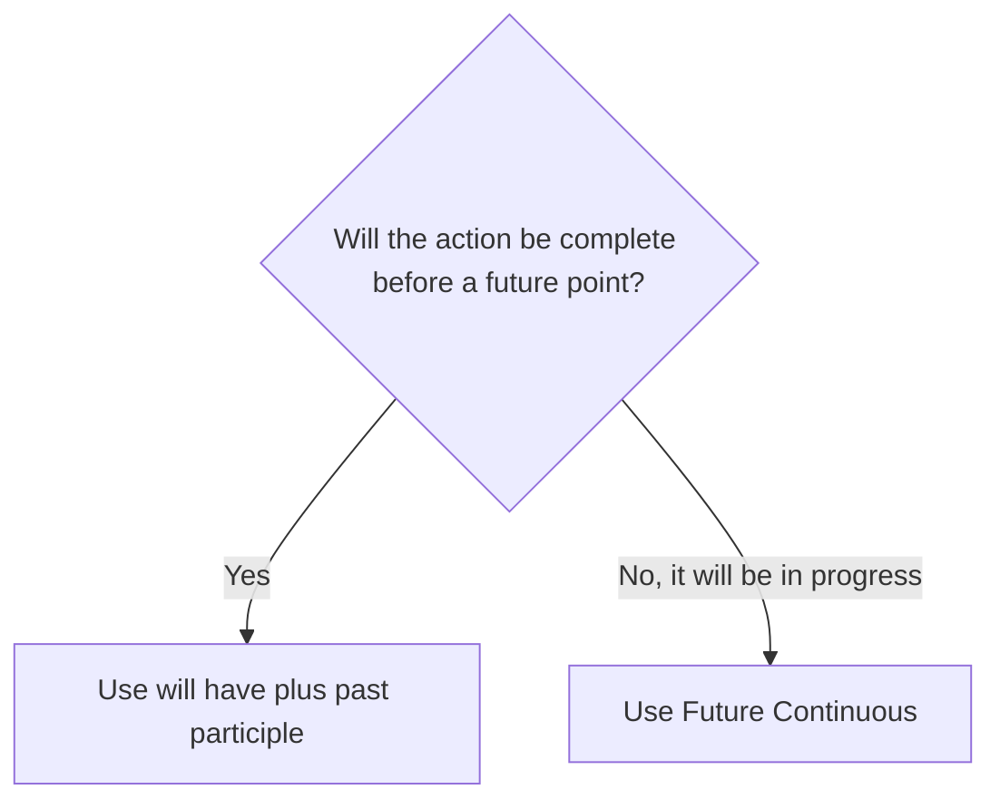

# Future Perfect

## Overview

Use the Future Perfect for an action that will be complete before a future time or deadline.

## Form patterns

| Use | Form pattern |
| --- | --- |
| Affirmative | `subject + will have + past participle + by + future time` |
| Negative | `subject + will not have + past participle + by + future time` |
| Question | `will + subject + have + past participle + by + future time?` |

## Examples in context

- By Friday, we **will have finished** the report.
- She **will have left** by the time we arrive.
- **Will** they **have completed** the work by June?

## Decision guide

## Register and frequency

This form is common in plans, deadlines, predictions, and formal updates. `By` often introduces the deadline.

## Common pitfalls

- Use a past participle: `will have finished`, not `will have finish`.
- Do not confuse `by` with `until`; `by` marks a latest completion time.
- Use it for completion, not merely future action.

## Mini practice

1. By next week, I ___ the course. (`finish`)
2. ___ she ___ by then? (`leave`)
3. They ___ the project by Friday. (`not complete`)

Answers

1. `will have finished`  
2. `Will / have left`  
3. `will not have completed`

