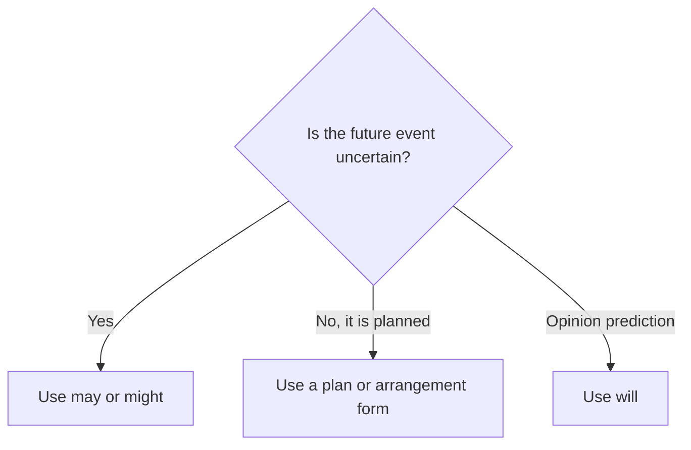

# May and might for future possibility

## Overview

Use **may** and **might** when a future event is possible but not certain. `Might` can sound a little less certain, but the difference is often small.

## Form patterns

| Use | Form pattern |
| --- | --- |
| Affirmative | `subject + may/might + base verb + future time` |
| Negative | `subject + may not/might not + base verb + future time` |
| Question | `may/might + subject + base verb...?` (formal and uncommon) |

## Examples in context

- We **may visit** Canada next year.
- It **might snow** tonight.
- She **may not come** if she is still ill.

## Decision guide

## Register and frequency

Both are neutral. `May` can sound slightly more formal; `might` is very common in conversation.

## Common pitfalls

- Use a base verb: `might go`, not `might to go`.
- Do not add `-s` after a modal.
- Use `may not` for possible non-occurrence; it does not usually mean prohibition here.

## Mini practice

1. It ___ rain later, so take an umbrella.
2. We ___ not finish before six.
3. She ___ join us tomorrow, but she is not sure.

Answers

1. `may` or `might`  
2. `may` or `might`  
3. `may` or `might`

