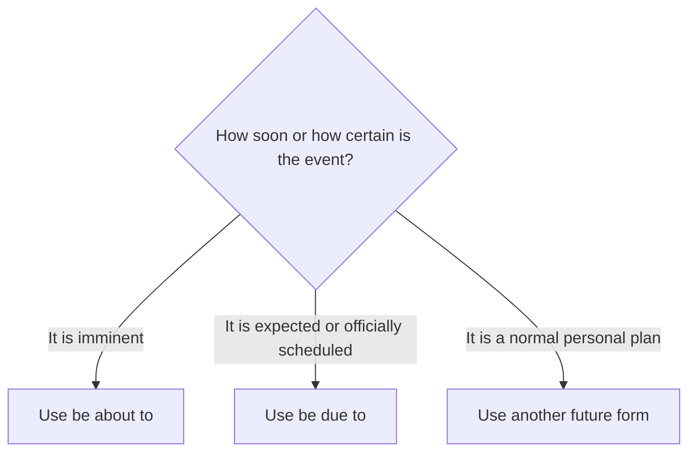

# Be about to and be due to

## Overview

Use **be about to** for something imminent. Use **be due to** for an expected or officially scheduled event.

## Form patterns

| Use | Form pattern |
| --- | --- |
| Imminent event | `subject + am/is/are about to + base verb + rest of the sentence` |
| Expected event | `subject + am/is/are due to + base verb + rest of the sentence` |
| Negative, uncommon | `subject + be not about to/due to + base verb + rest of the sentence` |

## Examples in context

- The show **is about to begin**.
- Hurry up! The bus **is about to leave**.
- The plane **is due to arrive** at 10.

## Decision guide

## Register and frequency

**Be about to** is common in speech. **Be due to** is more formal and common in travel, news, and official schedules.

## Common pitfalls

- Use a base verb after both expressions.
- Do not use `be about to` for a distant future plan.
- Do not confuse `due to + noun` (because of) with `be due to + verb` (expected to happen).

## Mini practice

1. The concert is ___ start.
2. The report is ___ be published next week.
3. The baby is ___ wake up; be quiet.

Answers

1. `about to`  
2. `due to`  
3. `about to`

