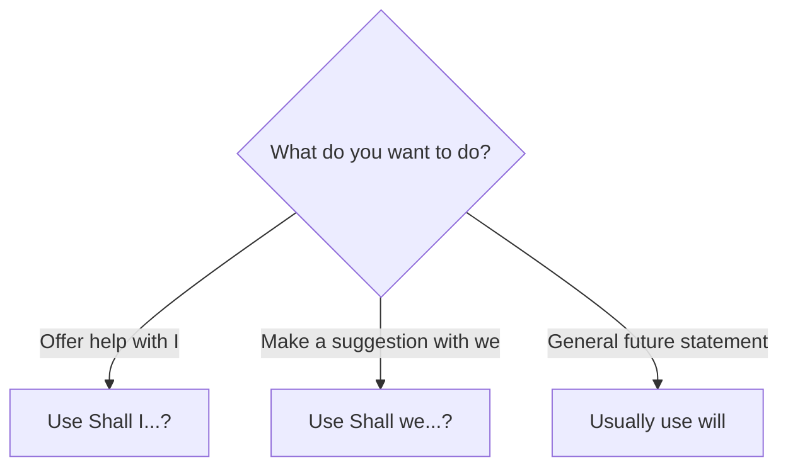

# Shall for offers and suggestions

## Overview

Use **shall** mainly with `I` and `we` to make an offer or suggestion. It is not the normal choice for general future statements in modern English.

## Form patterns

| Use | Form pattern |
| --- | --- |
| Offer | `shall + I + base verb + rest of the sentence?` |
| Suggestion | `shall + we + base verb + rest of the sentence?` |
| Formal future | `subject + shall + base verb + rest of the sentence` |

## Examples in context

- **Shall I open** the window?
- **Shall we start** the meeting?
- **Shall we order** some food?

## Decision guide

## Register and frequency

`Shall I...?` and `Shall we...?` are polite and natural. Affirmative `shall` for future statements is formal and uncommon, especially in American English.

## Common pitfalls

- Use a base verb after `shall`.
- Do not use `shall` as the default for all future statements.
- Do not use `Shall you...?` for an ordinary question.

## Mini practice

1. ___ I carry that bag for you?
2. ___ we take a break?
3. For a general prediction, use ___ instead of `shall`.

Answers

1. `Shall`  
2. `Shall`  
3. `will`

