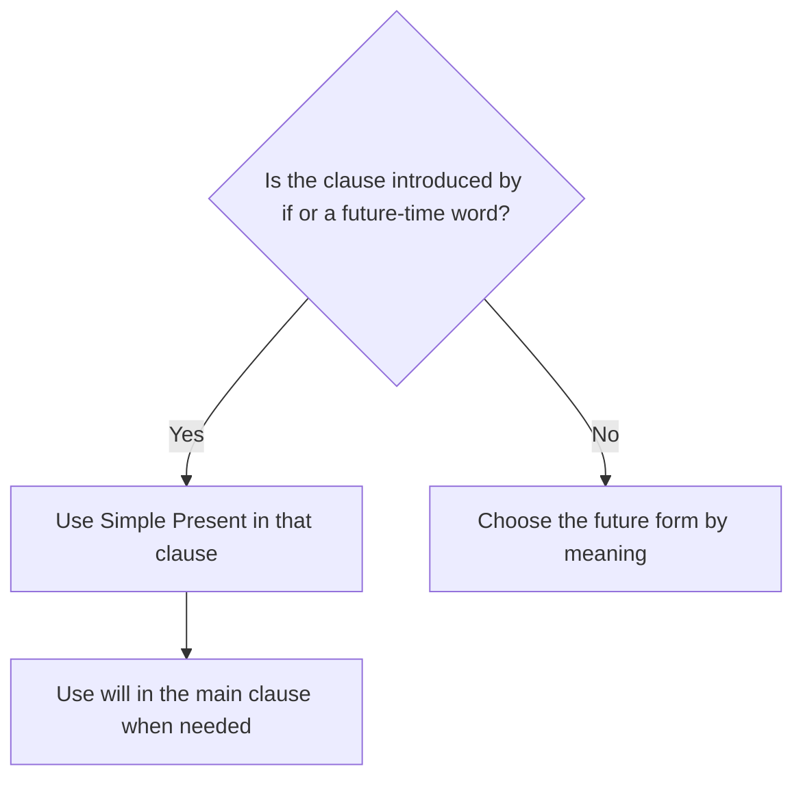

# Future time clauses

## Overview

After `if`, `when`, `before`, `after`, `as soon as`, and `until`, use a present form to refer to the future. Do not normally use `will` inside the time clause.

## Form patterns

| Use | Form pattern |
| --- | --- |
| Future result after a condition | `if + subject + simple present, subject + will + base verb` |
| Future result after a time clause | `when/as soon as + subject + simple present, subject + will + base verb` |
| Future time clause first or second | `subject + will + base verb + when/before/after + subject + simple present` |

## Examples in context

- If it **rains**, we **will stay** home.
- I **will call** you when I **arrive**.
- As soon as she **finishes**, she **will send** the report.

## Decision guide

## Register and frequency

This pattern is standard in spoken and written English and is essential for everyday future conditions and arrangements.

## Common pitfalls

- Do not say `If it will rain` for an ordinary condition.
- Use present simple even when the meaning is future.
- This rule does not apply to every use of `if`, such as polite requests.

## Mini practice

1. If she ___, we will start. (`arrive`)
2. I will text you when I ___. (`leave`)
3. As soon as they ___, they will call. (`finish`)

Answers

1. `arrives`  
2. `leave`  
3. `finish`

