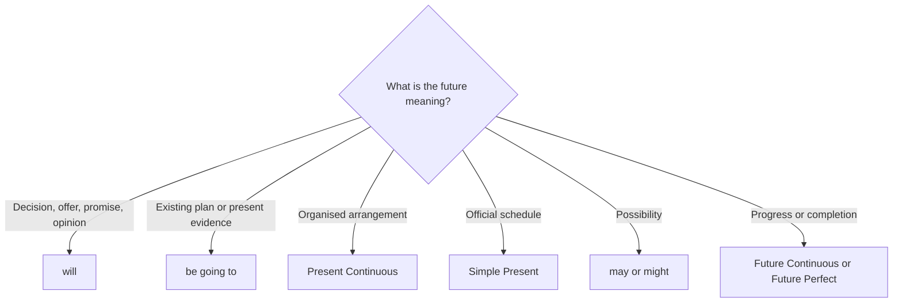

# Review — future forms

## Overview

Choose a future form by the reason for speaking about the future: decision, plan, arrangement, schedule, possibility, progress, completion, or condition.

## Quick map

| Meaning | Form pattern |
| --- | --- |
| decision, offer, promise, opinion prediction | `subject + will + base verb + rest of the sentence` |
| existing intention or present evidence | `subject + be going to + base verb + rest of the sentence` |
| organised arrangement | `subject + be + verb-ing + future time` |
| official schedule | `subject + simple present verb + future time` |
| possibility | `subject + may/might + base verb + future time` |
| action in progress | `subject + will be + verb-ing + future time` |
| action complete before a deadline | `subject + will have + past participle + by + future time` |

## Examples in context

- I think the meeting **will be** useful, but I'm **going to check** the agenda.
- We'**re meeting** at six, and the train **leaves** at seven.
- By Friday, we **will have finished** the project.

## Decision guide

## Register and frequency

For everyday use, master `will`, `be going to`, Present Continuous, and Simple Present schedules first. The other forms add precision.

## Common pitfalls

- Do not choose a form only because the event is far away or near.
- Use present simple in future time clauses.
- Do not mix `will` with `be going to` without a reason for the change.

## Mini practice

1. Look at those clouds. It ___ rain.
2. The train ___ at 6:30 tomorrow.
3. By next week, they ___ the work.
4. If it ___, we will cancel the picnic.

Answers

1. `is going to`  
2. `leaves`  
3. `will have finished`  
4. `rains`

