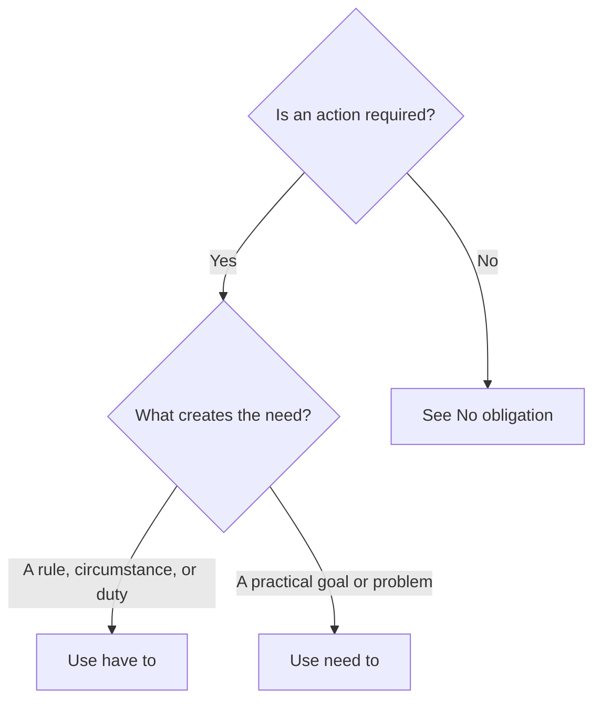

# Have to and need to

## Overview

Use **have to** and **need to** for necessary actions. **Have to** often emphasizes a rule or circumstance; **need to** often emphasizes a practical goal. The difference is a tendency, and both can be natural in the same situation.

## Form patterns

| Use | Have to | Need to |
| --- | --- | --- |
| Present affirmative | `subject + have/has to + base verb + rest of the sentence` | `subject + need/needs to + base verb + rest of the sentence` |
| Present negative | `subject + don't/doesn't have to + base verb + rest of the sentence` | `subject + don't/doesn't need to + base verb + rest of the sentence` |
| Present question | `Do/Does + subject + have to + base verb + rest of the sentence?` | `Do/Does + subject + need to + base verb + rest of the sentence?` |
| Past | `subject + had to + base verb + rest of the sentence` | `subject + needed to + base verb + rest of the sentence` |
| Future | `subject + will have to + base verb + rest of the sentence` | `subject + will need to + base verb + rest of the sentence` |

## Examples in context

- I **have to submit** the report by Friday because it is company policy.
- Does Mia **have to work** this weekend, or is she free?
- We **need to book** the tickets soon because the prices are increasing.

## Decision guide

## Register and frequency

Both forms are common in spoken and written English. **Have to** is especially common for rules and external requirements. **Need to** often sounds slightly more personal or practical.

## Common pitfalls

- Use a base verb: `has to leave`, not `has to leaves`.
- Use `had to`, not `must`, for a past obligation.
- Use `does ... have to`, not `does ... has to`.

## Mini practice

1. The museum closes at six, so we ___ leave soon.
2. ___ she have to wear a uniform at work?
3. Yesterday, I ___ cancel my appointment.

Answers

1. `need to` or `have to`  
2. `Does`  
3. `had to`

