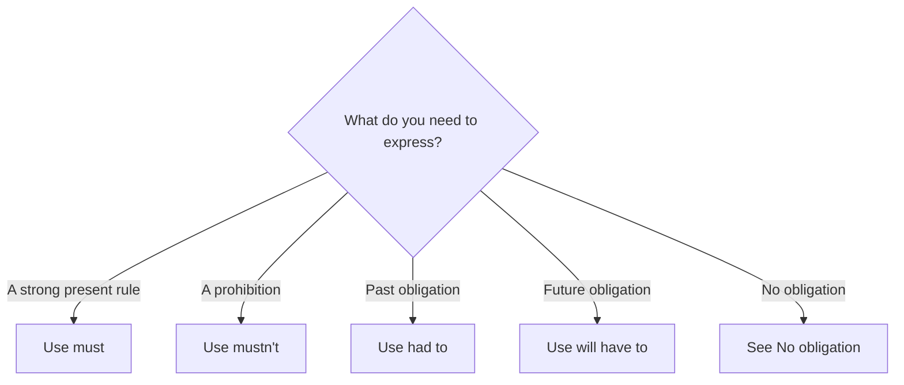

# Must and mustn't

## Overview

Use **must** for a strong obligation, a firm instruction, or a formal rule. Use **mustn't** when an action is prohibited.

`You mustn't park here` means parking is forbidden. `You don't have to park here` means parking is not required.

## Form patterns

| Use | Form pattern |
| --- | --- |
| Affirmative | `subject + must + base verb + rest of the sentence` |
| Negative | `subject + mustn't + base verb + rest of the sentence` |
| Question | `Must + subject + base verb + rest of the sentence?` |
| Past obligation | `subject + had to + base verb + rest of the sentence` |
| Future obligation | `subject + will have to + base verb + rest of the sentence` |

## Examples in context

- All passengers **must show** a valid passport before boarding.
- You **mustn't use** your phone during the exam.
- We **will have to leave** early tomorrow to avoid traffic.

## Decision guide

## Register and frequency

**Must** is common in rules, notices, and formal instructions. In everyday conversation, **have to** is often more natural for ordinary obligations. Questions with **must** are correct but can sound formal; `Do I have to...?` is more usual.

## Common pitfalls

- Use a base verb: `must leave`, not `must to leave` or `must leaves`.
- Do not use `mustn't` to mean “not necessary.” It means “not allowed.”
- Do not use `must` as the normal past form; use `had to`.

## Mini practice

1. Visitors ___ check in at reception.
2. You ___ enter this room without a key.
3. Last week, we ___ show our passports at the border.

Answers

1. `must`  
2. `mustn't`  
3. `had to`

