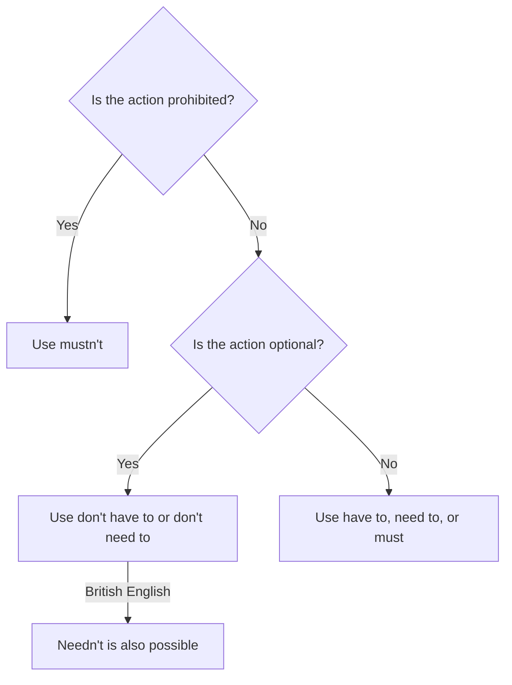

# No obligation

## Overview

Use **don't have to** and **don't need to** when an action is optional. In British English, **needn't** is also possible. Do not confuse these forms with **mustn't**, which expresses prohibition.

## Form patterns

| Use | Have to | Need to |
| --- | --- | --- |
| Present negative | `subject + don't/doesn't have to + base verb + rest of the sentence` | `subject + don't/doesn't need to + base verb + rest of the sentence` |
| Past negative | `subject + didn't have to + base verb + rest of the sentence` | `subject + didn't need to + base verb + rest of the sentence` |
| Future negative | `subject + won't have to + base verb + rest of the sentence` | `subject + won't need to + base verb + rest of the sentence` |
| British English | — | `subject + needn't + base verb + rest of the sentence` |

## Examples in context

- You **don't have to bring** a laptop; the room has computers.
- She **doesn't need to pay** today because the first month is free.
- You **mustn't enter** this area without protective equipment.

## Decision guide

## Register and frequency

**Don't have to** and **don't need to** are common in both British and American English. **Needn't** is mainly British and is less common in American English.

## Common pitfalls

- `You don't have to go` means going is optional.
- `You mustn't go` means going is forbidden.
- Use a base verb after these forms: `doesn't need to pay`, not `doesn't need to pays`.

## Mini practice

1. The event is free, so you ___ buy a ticket.
2. You ___ touch that switch; it is dangerous.
3. In British English: You ___ bring any food; lunch is provided.

Answers

1. `don't have to` or `don't need to`  
2. `mustn't`  
3. `needn't`

