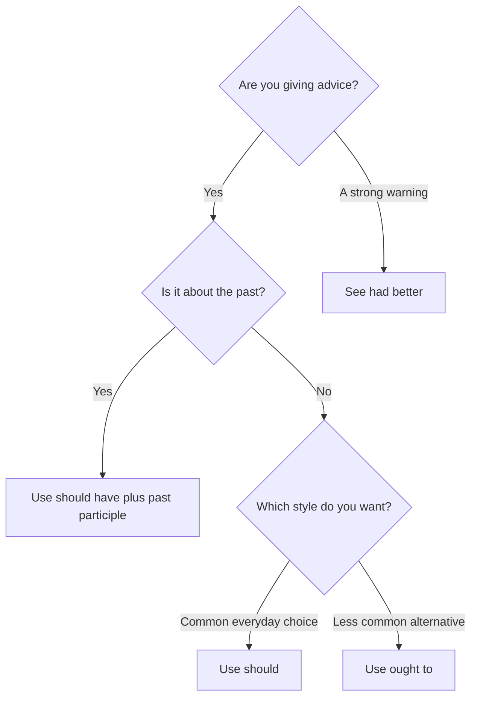

# Should and ought to

## Overview

Use **should** to give advice or make a recommendation. **Ought to** has nearly the same meaning but is less common in everyday conversation. Use **should have + past participle** for advice about a past situation.

## Form patterns

| Use | Should | Ought to |
| --- | --- | --- |
| Affirmative advice | `subject + should + base verb + rest of the sentence` | `subject + ought to + base verb + rest of the sentence` |
| Negative advice | `subject + shouldn't + base verb + rest of the sentence` | `subject + ought not to + base verb + rest of the sentence` |
| Question | `Should + subject + base verb + rest of the sentence?` | `Ought + subject + to + base verb + rest of the sentence?` |
| Past advice | `subject + should have + past participle + rest of the sentence` | `subject + ought to have + past participle + rest of the sentence` |

## Examples in context

- You **should take** an umbrella; it might rain later.
- You **shouldn't stay** up so late before an important exam.
- I **should have checked** the address before I left home.

## Decision guide

## Register and frequency

**Should** is the standard everyday choice. **Ought to** is correct but less frequent. Questions and negative forms with **ought to** are especially uncommon in casual speech.

## Common pitfalls

- Use a base verb: `should go`, not `should to go`.
- Use a past participle after `should have`: `should have told`, not `should have tell`.
- Do not use **should** for a strict rule when **must** or **have to** is intended.

## Mini practice

1. You ___ see a doctor if the pain continues.
2. You ___ have sent that email without checking it first.
3. You ___ to back up your files regularly.

Answers

1. `should`  
2. `shouldn't`  
3. `ought`

