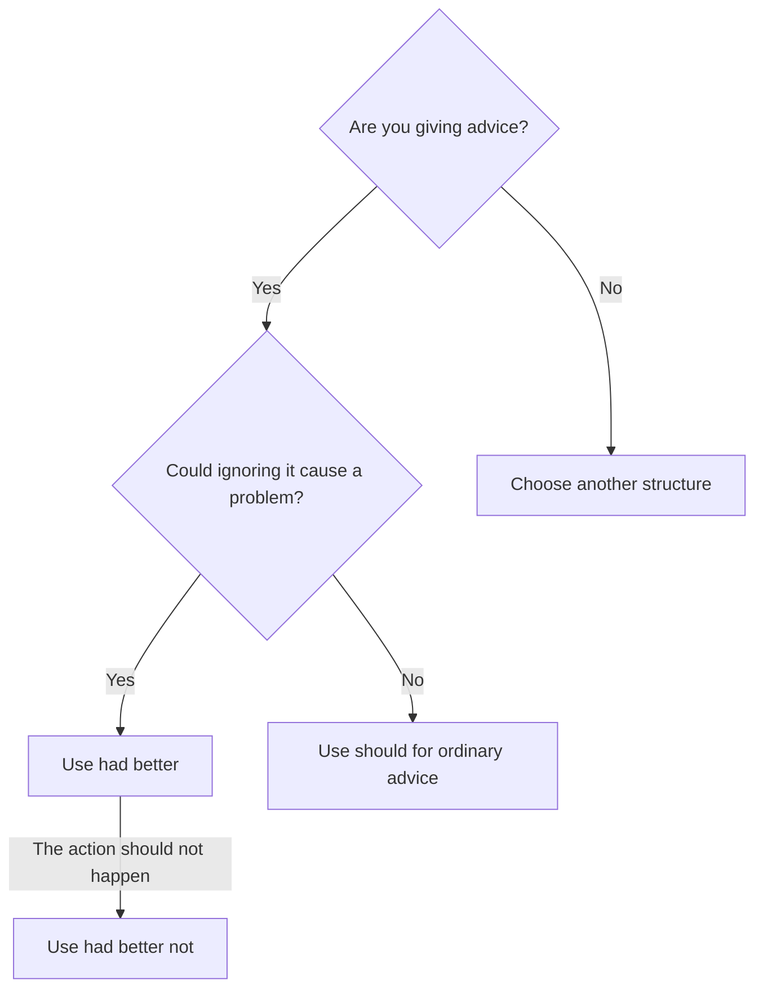

# Had better

## Overview

Use **had better** for strong advice, usually when ignoring the advice may cause a problem. Although it contains `had`, it normally refers to the present or future.

## Form patterns

| Use | Form pattern |
| --- | --- |
| Affirmative | `subject + had better + base verb + rest of the sentence` |
| Negative | `subject + had better not + base verb + rest of the sentence` |
| Common contraction | `subject + 'd better + base verb + rest of the sentence` |
| Question, formal and uncommon | `Had + subject + better + base verb + rest of the sentence?` |

## Examples in context

- You'd **better save** your work before the computer restarts.
- We'd **better not wait** too long, or the restaurant will close.
- They'd **better bring** warm clothes; it gets cold at night.

## Decision guide

## Register and frequency

**Had better** is common in speech and writing, but it is stronger than **should**. Direct questions with it are formal and rare; use `Should + subject + base verb...?` in normal conversation.

## Common pitfalls

- Do not use `to`: `You'd better leave`, not `You'd better to leave`.
- Put `not` after `better`: `You'd better not wait`.
- Do not read `had` as past time in this expression.

## Mini practice

1. The roads are icy. You'd better ___ slowly.
2. We'd better not ___ the deadline.
3. For ordinary, non-urgent advice, use ___ instead.

Answers

1. `drive`  
2. `miss`  
3. `should`

