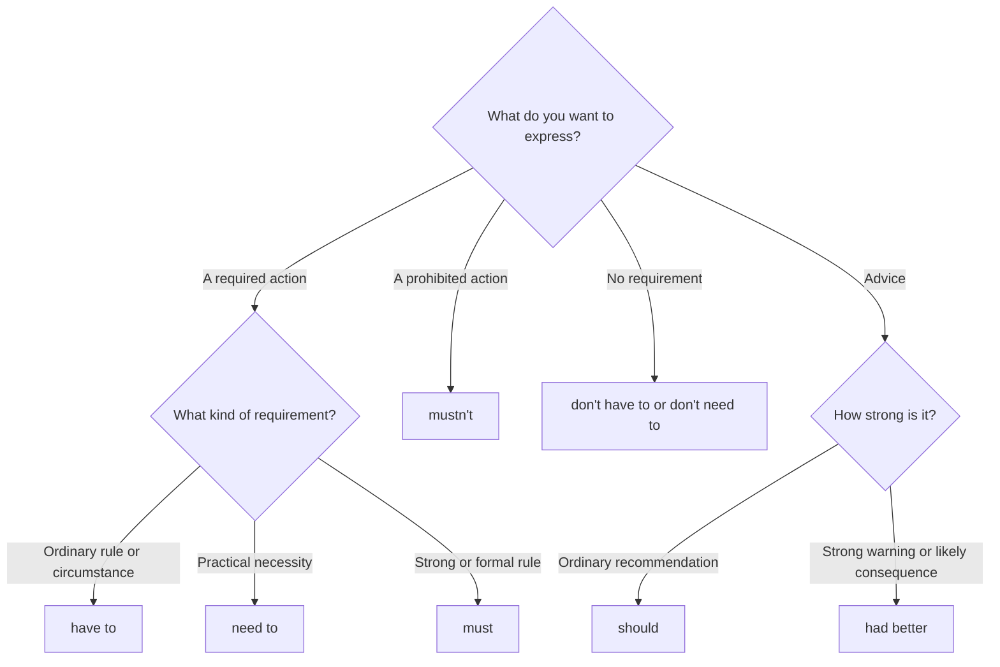

# Review — obligation, necessity, and advice

## Quick map

| Idea | Form pattern | Example |
| --- | --- | --- |
| practical obligation | `subject + have/has to + base verb + rest of the sentence` | I have to wear a uniform. |
| practical necessity | `subject + need/needs to + base verb + rest of the sentence` | I need to charge my phone. |
| strong rule | `subject + must + base verb + rest of the sentence` | You must show your ID. |
| prohibition | `subject + mustn't + base verb + rest of the sentence` | You mustn't smoke here. |
| no obligation | `subject + don't/doesn't have to + base verb + rest of the sentence` | You don't have to come. |
| advice | `subject + should + base verb + rest of the sentence` | You should rest. |
| strong advice | `subject + had better + base verb + rest of the sentence` | You'd better leave now. |

## Examples in context

- You **have to wear** a helmet on this site, but you **don't have to bring** your own.
- You **mustn't share** this password, but you **need to change** it today.
- You **should call** the hotel now; you'd **better not wait** until all the rooms are gone.

## Decision guide

## Register and frequency

For everyday obligations, prefer **have to**. Use **must** for strong or formal rules. Prefer **should** for ordinary advice and **had better** for urgent advice. **Needn't** and **ought to** are less common in American everyday English.

## Common pitfalls

- `mustn't` means prohibited; `don't have to` means optional.
- Use `had to` for past obligation and `will have to` for future obligation.
- Use a base verb after `must`, `should`, and `had better`.

## Mini practice

1. It is optional, so you ___ attend the meeting.
2. This information is confidential. You ___ tell anyone.
3. You have an interview tomorrow. You ___ arrive early.
4. The train leaves in two minutes. We ___ go now.

Answers

1. `don't have to` or `don't need to`  
2. `mustn't`  
3. `should`  
4. `had better`

