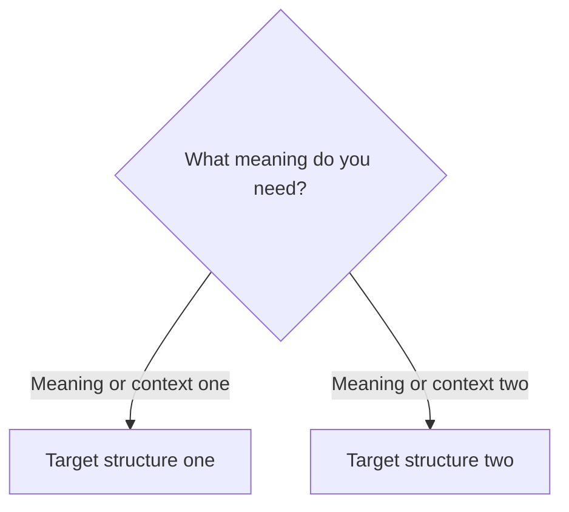

# Didactic Grammar Note Template

Use this reference when creating a note with `english-grammar-topic-creator`. It is based on the established `obligation-necessity-and-advice` module.

## Required note structure

```markdown
# Topic title

## Overview

Explain the core meaning, the learner's default choice, and any important limit in two to four short paragraphs.

## Form patterns

| Use | Form pattern |
| --- | --- |
| Present affirmative | `subject + target structure + base verb + rest of the sentence` |
| Present negative | `subject + negative target structure + base verb + rest of the sentence` |
| Question | `auxiliary/modal + subject + target structure + base verb + rest of the sentence?` |

Include only forms that are grammatical and useful. If the target structure uses a replacement in another time frame, show that replacement explicitly.

## Examples in context

- Three or more short, natural examples with enough context to clarify the choice.
- Cover the central use and at least one meaningful contrast when possible.

## Decision guide



The diagram must represent a real decision. Keep node labels short, use valid Mermaid syntax, and avoid decorative branches.

## Register and frequency

State the learner's best everyday default. Mention formal, informal, British, American, or less frequent variants only when useful.

## Common pitfalls

- List two to four mistakes that are likely to change meaning or form.
- Show the correct and incorrect pattern when that makes the distinction clearer.

## Mini practice

1. Three to five short retrieval exercises.
2. Each item tests one decision or one form.

<details>
<summary>Answers</summary>

1. `answer`
</details>
```

## File design

- Use `01-`, `02-`, and subsequent numeric prefixes for the recommended study order.
- One file should teach one coherent decision or closely linked contrast.
- Begin with common default forms; put strong, formal, regional, or advanced variants later.
- A final review note is useful for broad modules with three or more competing choices. It should have a quick comparison table, a general Mermaid decision guide, and mixed mini practice.

## Quality checklist

- Every form table includes the subject and the complete construction.
- Examples, diagrams, pitfalls, and exercises all agree with the same meaning distinction.
- Exercises have one preferred answer, or accepted alternatives are stated.
- The note remains entirely in the requested language.
- The note teaches use in context, not only a list of rules.
